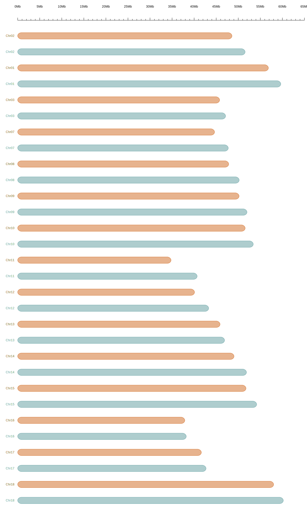

# recos user manual
### 1. Quick start

> Install Singularity in your OS, you can refer <https://docs.sylabs.io/guides/latest/user-guide/quick_start.html>.
>
> git clone https://github.com/zhk2017/recos.git
>
> download base img 

### 2. Example dataset
There are five example dataset for beginers,  change  the directory into the data path, and *sh run.sh*. when the job is finished, a SVG format picture will be generated. You can use Chromo browser to open it. 

### 3. Figure 

